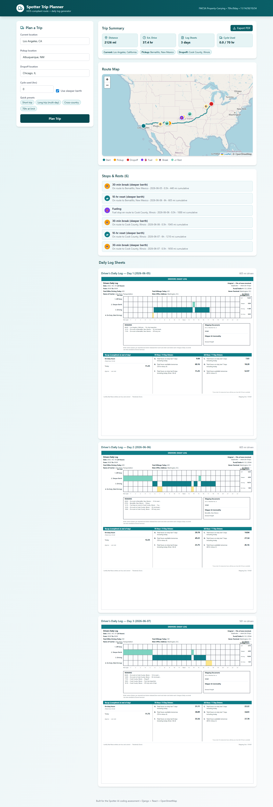
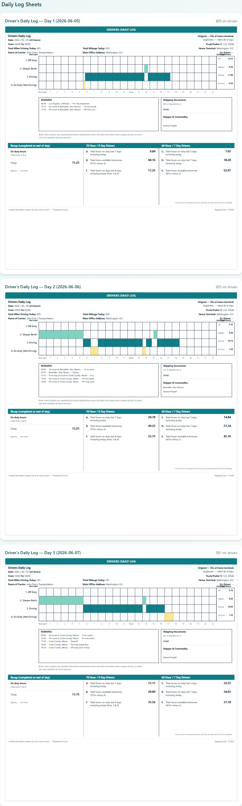

# Spotter Trip Planner

A full-stack trip planner that takes a driver's current location, pickup, dropoff, and remaining 70-hour cycle, then produces an FMCSA-compliant route plus one or more filled-in **Driver's Daily Log** sheets — the same paper form every US commercial driver fills out by hand.



> Live demo: **[frontend-three-sage-11.vercel.app](https://frontend-three-sage-11.vercel.app/)**
> API: **[spotteraiassessment.onrender.com/api/health/](https://spotteraiassessment.onrender.com/api/health/)**

---

## What it does

| Input | Output |
|---|---|
| Current location, pickup, dropoff (free-text cities) | OSRM driving route on a Leaflet map |
| Current cycle used (0-70 hr) | One or more daily log sheets (multi-day for long trips) |
| Use sleeper berth? (default on) | Sleeper-berth 10-hr reset / 30-min break variant |
| | HOS-compliant timeline (driving + on-duty + sleeper + off-duty) |
| | Filled-in SVG daily log matching the canonical FMCSA paper form |
| | Fuel, break, and rest stops extracted on the map and in a list |
| | Vector PDF export (jsPDF) — one page per daily log |

The most distinctive output is the daily log: a 900×940 SVG that matches the canonical FMCSA paper form cell-for-cell, including the recap table (A./B./C./D./E./F. cells for the 70hr/8day and 60hr/7day driver schedules).



---

## Stack

| Layer | Tech |
|---|---|
| Backend | Django 6.0 + Django REST Framework 3.17 + gunicorn |
| HOS engine | Pure Python (no numpy, no external deps) — **20 unit tests** |
| Geocoding | Nominatim (OSM) → Photon (Komoot) fallback, in-memory LRU + circuit breaker |
| Routing | OSRM public demo server |
| Frontend | Vite + React 19 + TypeScript + Tailwind 4 |
| Map | Leaflet 1.9 + OpenStreetMap tiles |
| PDF | jsPDF (vector) |
| Tests | `unittest` (engine) + `pytest` (backend) + Playwright (e2e) — **115 total** |

No paid services, no API keys, no secrets. Runs on Render + Vercel free tiers.

---

## HOS rules implemented (FMCSA-HOS-395, April 2022)

- **11-hour driving limit** per shift
- **14-hour on-duty window** starting at first on-duty
- **30-minute break** after 8 cumulative driving hours
- **10-hour reset** between shifts (off-duty *or* sleeper berth)
- **70-hour / 8-day rolling** cycle cap
- **34-hour restart** to reset the 70/8 clock
- **Fueling stop** every 1,000 mi
- **1 hr on-duty** for pickup + dropoff
- **Pre-trip + post-trip inspection** (0.25 hr each)
- **24-hour invariant** — every daily log sums to exactly 24 hr
- **Midnight day boundary** — pre-shift off-duty fills the morning of the first day

Assumptions per spec: property-carrying CMV, 70hr/8day schedule, no adverse conditions, 55 mph average.

---

## Architecture

```
                ┌─────────────────────┐
   React form ──▶│  POST /api/trip/   │──▶ OSRM (route) ──▶ geometry
                │  (DRF view)         │
                │                     │──▶ Nominatim/Photon (3× geocode)
                │                     │──▶ hos_engine.generate_trip
                │                     │     (pure-Python HOS simulator)
                │                     │──▶ compute_recap (FMCSA recap)
                └──────────┬──────────┘
                           ▼
              JSON: { stops, rest_stops, route, days[i] {events, totals, status_quarters, recap} }
                           │
                           ▼
                ┌─────────────────────┐
                │  React UI           │
                │  ├─ TripForm        │
                │  ├─ RouteMap (Leaflet) ── markers for main stops + rest stops
                │  ├─ Stops & Rests list
                │  ├─ DailyLog (SVG)  ── 900×940 paper-form replica
                │  └─ jsPDF export    ── vector PDF, one page per day
                └─────────────────────┘
```

The HOS engine is the heart of the system. It's a pure-Python event simulator: given a `TripInput` (three `Point`s, cycle used, speed, start time), it walks the timeline and emits a list of `Event`s with status, duration, location, and remark. Then `group_by_day` partitions them into `DayLog`s, and `compute_recap` attaches the FMCSA-form recap to each day.

See **[docs/architecture.md](docs/architecture.md)** for the full write-up.

---

## Project structure

```
assessments/spotterAI/
├── backend/
│   ├── hos_engine.py            ← pure-Python HOS engine (20 unit tests)
│   ├── test_hos_engine.py       ← 20 HOS engine unit tests
│   ├── geocoding.py             ← Nominatim + Photon, LRU cache + circuit breaker
│   ├── routing.py               ← OSRM client
│   ├── spotter_backend/         ← Django project (settings, urls, wsgi)
│   ├── trip/                    ← Django app (views, serializers)
│   ├── tests/                   ← 54 pytest tests (mocked + live)
│   ├── requirements.txt
│   ├── Procfile                 ← Render entry point
│   └── pytest.ini
├── frontend/
│   ├── src/
│   │   ├── App.tsx              ← header, layout, state
│   │   ├── components/
│   │   │   ├── TripForm.tsx
│   │   │   ├── RouteMap.tsx     ← Leaflet + rest-stop markers + legend
│   │   │   └── DailyLog.tsx     ← 900×940 SVG paper-form replica
│   │   └── lib/
│   │       ├── api.ts
│   │       ├── types.ts
│   │       └── pdfExport.ts     ← vector PDF (mirrors DailyLog SVG)
│   ├── tests/e2e/               ← 20 Playwright tests
│   └── scripts/
│       └── take-fresh-shots.ts  ← dev tool: regenerates docs/screenshots/
├── docs/
│   ├── architecture.md          ← engine + system design
│   ├── references/              ← FMCSA reference materials
│   ├── screenshots/             ← UI screenshots (used in this README)
│   └── sample-pdfs/             ← exported multi-day PDFs
├── .github/workflows/ci.yml     ← CI: pytest + Playwright
├── run-all-tests.sh             ← run both test suites locally
└── README.md
```

---

## Testing

**115 tests** across three suites, all green in CI.

| Suite | Runner | Count | What it covers |
|---|---|---|---|
| HOS engine | `unittest` | 20 | Pure-Python engine: every FMCSA rule, 24-hr invariant, edge cases, recap math |
| Backend API | `pytest` | 74 | DRF endpoint: validation, mocked pipeline, all 4 form presets, sleeper on/off, cycle cap, live network |
| Frontend e2e | Playwright | 21 | Form, presets, full submit flow, multi-day results, rest stops, recap table, PDF download |

```bash
cd backend
python -m pytest tests/ --tb=short       # mocked + live
python -m pytest tests/ -m "not live"    # mocked only (~3s)

cd ../frontend
npx playwright test                      # all 21 (~2 min on first run)
```

CI: GitHub Actions runs both suites on every push — see `.github/workflows/ci.yml`.

---

## Running locally

### Backend
```bash
cd backend
python -m pip install -r requirements.txt
python manage.py runserver 8001   # http://127.0.0.1:8001
```

### Frontend
```bash
cd frontend
npm install
npm run dev                       # http://127.0.0.1:5173 (proxies /api to :8001)
```

### Both at once
```bash
./run-all-tests.sh                # boots both, runs both test suites
```

---

## API

`POST /api/trip/`

```json
{
  "current_location": "New York, NY",
  "pickup_location": "Philadelphia, PA",
  "dropoff_location": "Baltimore, MD",
  "current_cycle_used_hrs": 0,
  "use_sleeper_berth": true
}
```

Returns the full plan including the route geometry, the day-by-day log with 96 quarter-hour status buckets per day, and the recap table for the FMCSA form.

---

## Deploy

Both free-tier, no secrets.

- **Backend** → [Render](https://render.com) Web Service, `gunicorn spotter_backend.wsgi:application`
- **Frontend** → [Vercel](https://vercel.com) static site, `npm run build`, env `VITE_API_URL` points at Render

Live URLs at the top of this README.

---

## What I'd add with more time

- **Per-day mileage validation** — the current `total_mileage` is a copy of `total_miles`; should split deadhead vs loaded.
- **Recap math from real history** — A./C./D. are currently approximated from the user's single `cycle_used_hrs` value. A real product would track per-day on-duty over an 8-day history.
- **Persistent driver profiles** — currently all state is per-request.
- **Map clustering for rest stops** — Leaflet supercluster for very long trips with many breaks.
- **A real DB-backed state machine** for the engine instead of the current list-of-events approach.

---

Built for the Spotter AI Full-Stack Developer coding assessment. ~16 hours of work, 4 days.
